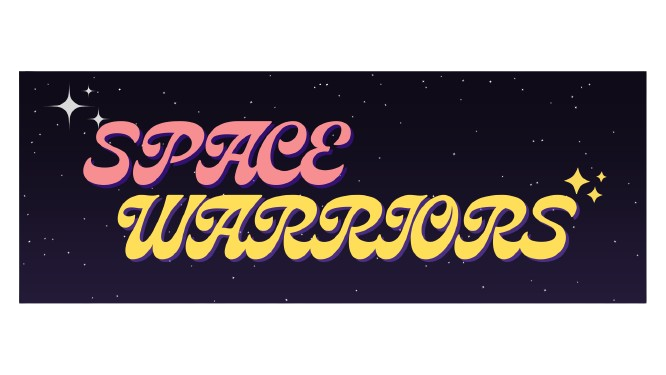

# SPACE WARRIORS

## [Click here to play the Game!](https://bluesaurio.github.io/space-warriors/)

# Description

Space Warriors is a scrolling shooter arcade videogame, where you pilot your ship against the evil space creatures trying to invade us! Their leader is waiting for you at the end of your journey.. Will you be able to beat him?

Try to get your best score in the proccess!

# Main functionalities

- You can freely move your ship to all directions using all `Arrow Keys`.
- Fire to your enemies pressing `Z key`.
- Don't get touched by any enemy, or anything they use against you, or you will lose the game.
- The game ends once you beat the final `Boss`.
- You can see your score when you lose the game or you finish it by winning.
- The `Boss` give a huge amount of score, so you better defeat him!

# Backlog functionalities

- Pause game.
- Longer stages.
- Power-Ups.
- DIfferent ships, with different Power-Ups.
- Different kind of enemies.
- More animations.
- Responsivity

# Technologies used

- HTML
- CSS
- JavaScript
- DOM Manipulation
- JS Classes
- Local Storage
- JS Audio() and JS Image()

# States

- Splash Screen
- Game Screen
- Game Over Screen
- Victory Screen

# Project Structure

## main.js

- DOM building
- startGame()
- resetGame()
- playAgain()
- victoryOstPlay()
- stopVictoryOst()
- stopGameMusic()
- stopGameOverMusic()
- enemyDyingSound()
- playShotSound()
- playBossAttackSound()
- playBossWaveSound()
- Event Listeners

## game.js

- Game()

  - this.timer
  - this.isGameOn
  - this.player
  - this.score
  - this.scoreNode
  - this.finalScoreNode
  - this.deadScoreNode
  - this.enemyArr
  - this.projectyleArr
  - this.bossAttackArr
  - this.bossWaveArr
  - this.boss

- collisionCheckPlayerBoss()
- collisionCheckPlayerEnemy()
- collisionCheckPlayerBossAttack()
- collisionCheckPlayerWave()
- collisionCheckShotBoss()
- collisionCheckEnemyShot()
- playerShooting()
- bossAttack()
- bossWave()
- blinkWaveAnimation()
- blinkAttackAnimation()
- bossLifesCheck()
- enemySpawnFirstWave().... until enemySpawnTwentyfirstWave()
- bossSpawn()
- enemyDisappear()
- shotDisappear()
- bossAttackDisappear()
- bossWaveDisappear()
- gameOver()
- gameWin()
- gameLoop()

## player.js

- Player()

  - this.node
  - this.node.src
  - this.h
  - this.w
  - this.x
  - this.y
  - this.playerMovingUp
  - this.playerMovingDown
  - this.playerMovingRight
  - this.playerMovingLeft
  - this.movementSpeed
  - this.node.style.width
  - this.node.style.heigth
  - this.node.style.position
  - this.node.style.left
  - this.node.style.top

- playerMovementUp()
- playerMovementDown()
- playerMovementLeft()
- playerMovementRight()

## enemy1.js

- Enemy()

  - this.node
  - this.node.src
  - this.h
  - this.w
  - this.x
  - this.y
  - this.direction
  - this.speed
  - this.node.style.width
  - this.node.style.heigth
  - this.node.style.position
  - this.node.style.left
  - this.node.style.top

- autoMovement()

## boss.js

- Boss()
  - this.node
  - this.node.src
  - this.stage
  - this.soundtrack.node
  - this.soundtrack.node.src
  - this.soundtrack.node.volume
  - this.direction
  - this.lifes
  - this.h
  - this.w
  - this.x
  - this.y
  - this.speed
  - this.node.style.width
  - this.node.style.heigth
  - this.node.style.position
  - this.node.style.left
  - this.node.style.top

. movement()

## bossWave.js

- BossWave()

  - this.node
  - this.node.src
  - this.node.style.opacity
  - this.h
  - this.w
  - this.x
  - this.y
  - this.speed
  - this.node.style.width
  - this.node.style.heigth
  - this.node.style.position
  - this.node.style.left
  - this.node.style.top

- movement()

## bossAttack.js

- BossAttack()

  - this.node
  - this.node.src
  - this.node.style.opacity
  - this.h
  - this.w
  - this.x
  - this.y
  - this.speed
  - this.node.style.width
  - this.node.style.heigth
  - this.node.style.position
  - this.node.style.left
  - this.node.style.top

- movement()

# Extra Links

### [Slides](https://docs.google.com/presentation/d/1K5bm5lnjUzB5gkIQeJ8OvVlb3PZZYbpGZQQNUAKkSg0/edit?usp=sharing)

### [Deploy](https://bluesaurio.github.io/space-warriors/)
